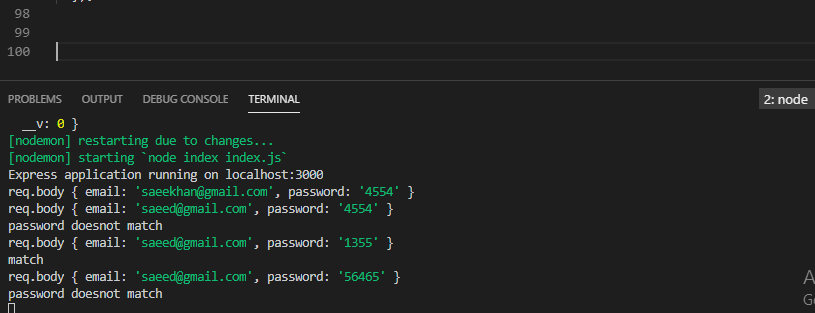
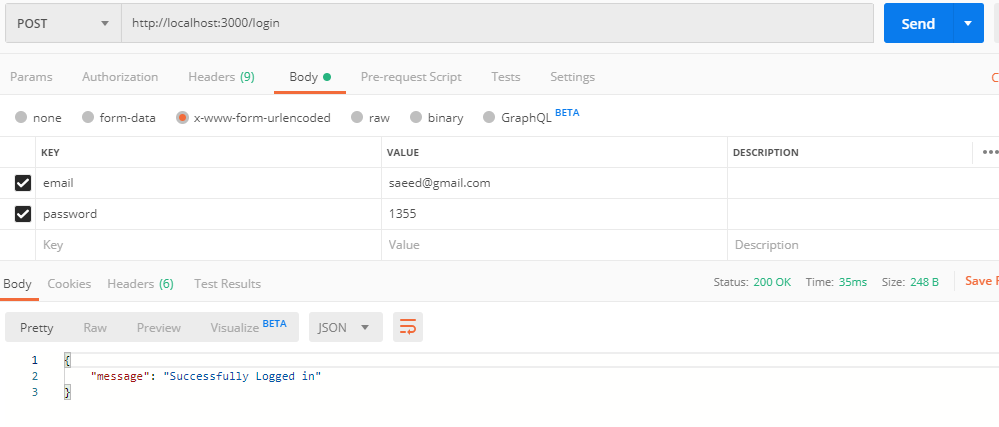
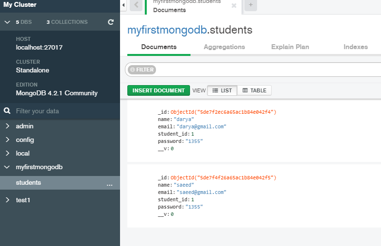
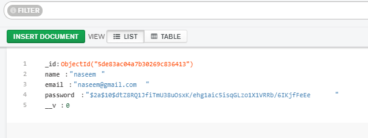
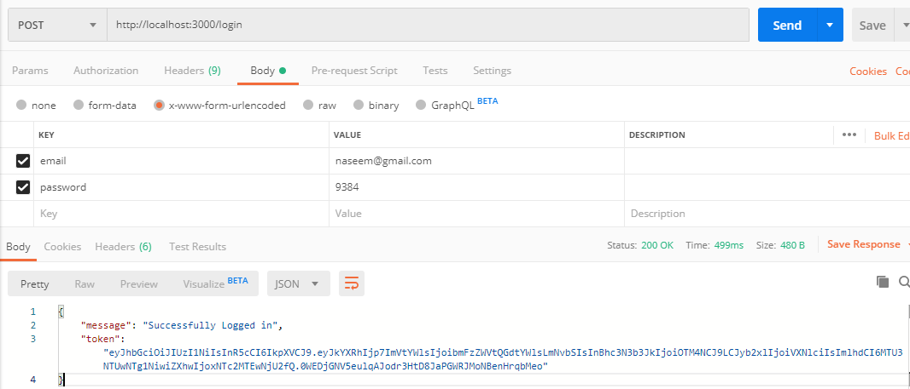
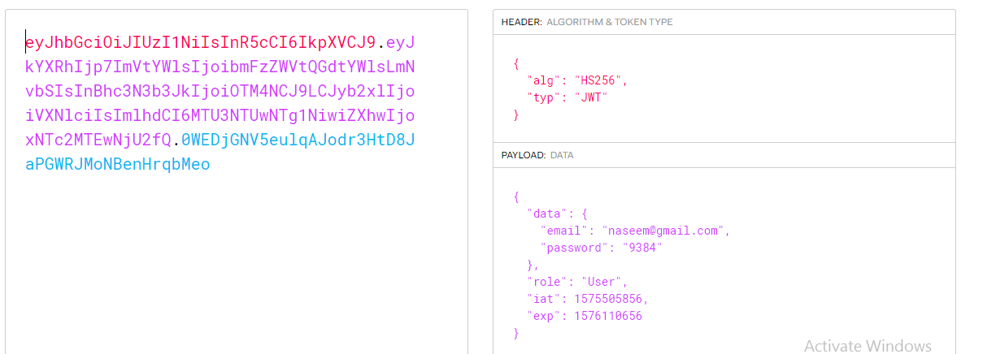

### node.js application with mogodb post and get methods using postman
### console output

### using postman

### databas documents

### part 3
### password encrypted 

### Token returned in postman

### Token in jwt.io

